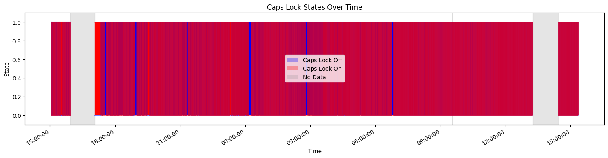
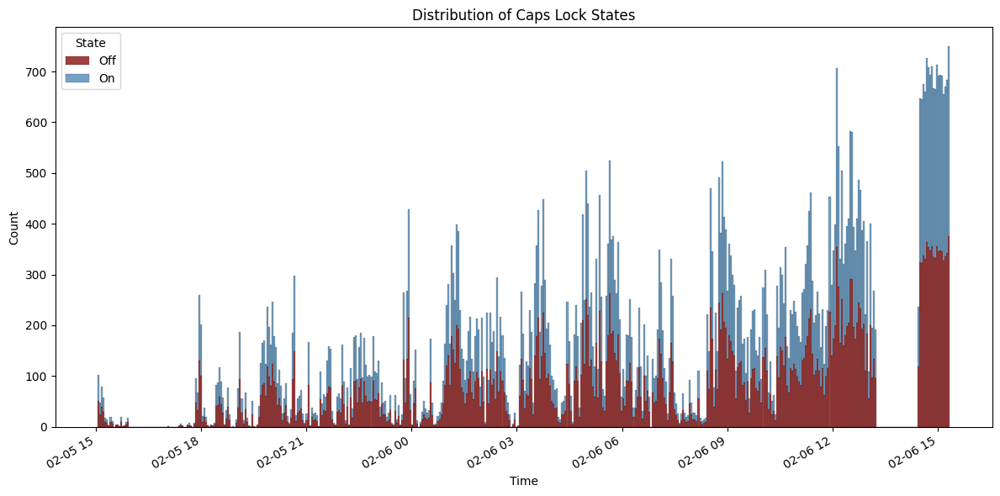

# What is this?

Days ago [itseieio](https://eieio.games/) blessed the world with [THE GLOBAL CAPS LOCK KEY](https://eieio.games/blog/the-global-capslock-key/).

I was curious and plugged into the websocket and started monitoring caps lock changes. 
As you can imagine, it's a mess.

Check out this histogram!

## Could this be a source of entropy?

Like how [random.org](https://random.org) uses sophisticated methods to turn
atmospheric noise into randomness, we can turn caps lock toggling into digits too!

And so I made this random number generator to see if it's possible and remotely reliable.
And it's not really. I'll tinker a more with this but it doesn't look like there's
enough variation in the time between caps lock changes.

Regardless, enjoy.

## Can I use this?

Sure! Check it out at https://global-caps-lock-rng.fly.dev/integers

Use query parameters like: `n`, `min_val`, and `max_val`.

## Can I use this in production?

Yeah! What's the worst that could happen?
